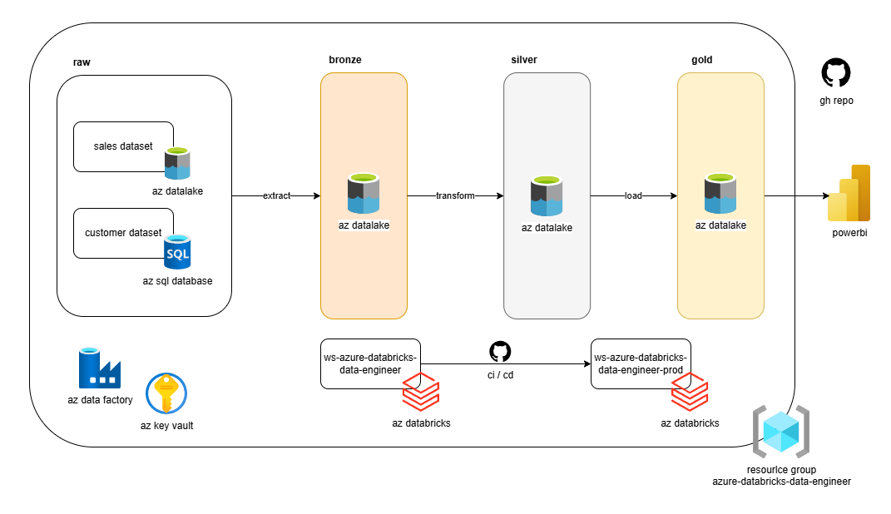

# Azure Databricks Data Engineer – Final Project

Repositorio que contiene el desarrollo completo de un proyecto final de **Azure Databricks Data Engineer**, donde se implementa una **ETL con arquitectura Medallion (Bronze / Silver / Gold)** a partir de dos datasets:

- **Customers** → Azure SQL Database  
- **Sales** → Azure Data Lake (container)

---

## 🔹 Arquitectura General

- Ingesta desde Azure SQL Database y Azure Data Lake  
- Procesamiento con Azure Databricks  
- Gobierno de datos con Unity Catalog  
- Orquestación con Jobs de Databricks  
- CI/CD con GitHub Actions  
- Visualización con Power BI  

---

## 🔹 Tecnologías

- Azure Databricks  
- Azure Data Lake Storage Gen2  
- Azure SQL Database  
- Azure Data Factory  
- Azure Key Vault  
- Unity Catalog  
- GitHub Repositories  
- GitHub Actions  
- Power BI  

---

## 🔹 Arquitectura Medallion

**Bronze**  
Ingesta e incorporación de datos crudos.

**Silver**  
Limpieza, estandarización y enriquecimiento.

**Gold**  
Hechos, dimensiones y agregados listos para consumo analítico.

---

## 🔹 Consumo Analítico

La capa **Gold** es consumida desde Power BI mediante **Databricks SQL Warehouse** para construir dashboards de ventas y clientes.

---

## 🔹 Seguridad y Permisos

- Creación de grupo de usuarios por proyecto  
- Grants sobre catálogo, esquemas y tablas  
- Permisos sobre External Locations  
- Uso de Storage Credentials  
- Scripts de reversión (REVOKE y DROP) para limpieza controlada  

---

## 🔹 CI/CD (GitHub Actions)

Pipeline automatizado que:

- Exporta notebooks desde workspace DEV  
- Publica notebooks en workspace PROD  
- Re-crea el Job multi-task  
- Agenda ejecución mensual  
- Ejecuta el ETL automáticamente  

---

## 🔹 Estructura del Repositorio
```
PROJECT-AZDTBR-DATA-ENGINEER-RENZOCAVERO/
├── .github/
│   └── workflows/
│       └── deploy-notebook.yml        # CI/CD Databricks
├── certificaciones/                   # Material y evidencias de certificaciones
├── dashboard/                         # Artefactos de Power BI / consultas
├── datasets/                          # Archivos de referencia / muestras
├── prepamb/                           # Preparación de ambiente
├── proceso/                           # Extract / Transform / Load
├── seguridad/                         # Grants y control de accesos
├── reversion/                         # Revoke y drop de objetos
└── README.md                          # Documentación principal
```

---

## 👤 Autor

**Renzo Cavero**  
MLE & MLOps


